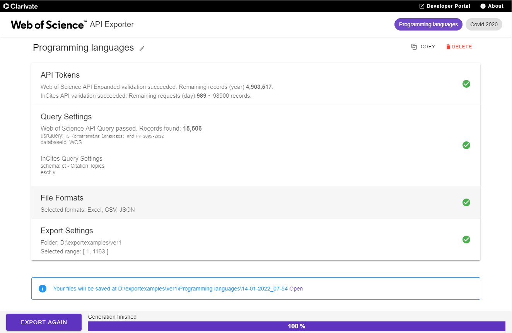

# Web of Science API Exporter

This tool allows you to convert the Web of Science API data to Excel/CSV by using the [Web of Science API Expanded](https://developer.clarivate.com/apis/wos) and [InCites API](https://developer.clarivate.com/apis/incites). The APIs require a paid license. Please get in touch with [Web of Science Support](https://support.clarivate.com/ScientificandAcademicResearch/s/?language=en_US) or visit [Developer Portal](https://developer.clarivate.com/) to learn more about the subscription process.

The initiative comes from the Web of Science API Product team to help the API users easily understand the data represented as tables. Furthermore, you can easily import to BI Tools, such as PowerBI or Tableau. The tool is free, licensed as open-source under GPL-3.0.

Although the Web of Science API product team is the primary maintainer, we welcome anyone to contribute. If you found an issue or have an idea for a feature, please [report it](https://github.com/Clarivate-SAR/wos-excel-converter/issues/new/choose) in GitHub instead of contacting Clarivate Support. This tool uses Electron/Typescript/Vue. If you are familiar with those technologies, feel free to make a pull request in GitHub with your ideas, we would appreciate it.

Download and Install:
- [Windows](https://github.com/clarivate/wos-excel-converter/releases/download/v1.0.0-rc3/wos-api-exporter-setup-1.0.0-rc3.exe)
- [Mac](https://github.com/clarivate/wos-excel-converter/releases/download/v1.0.0-rc3/wos-api-exporter-1.0.0-rc3.dmg)
- [Linux tar.gz](https://github.com/clarivate/wos-excel-converter/releases/download/v1.0.0-rc3/wos-api-exporter-1.0.0-rc3.tar.gz)

### License
GPL-3.0 License
